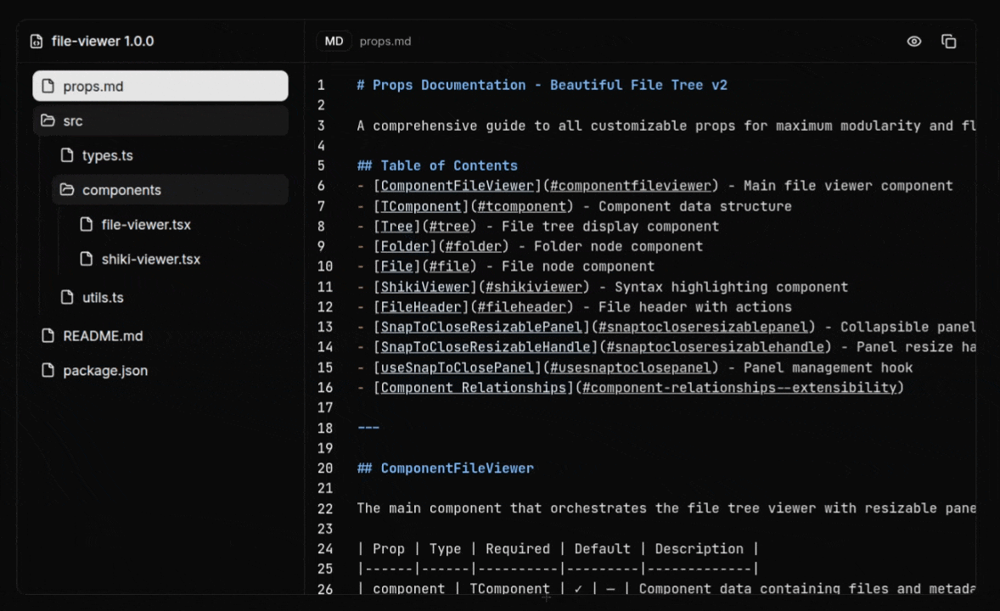

# Beautiful File Tree v2



A powerful file viewer component with modern features and beautiful design.

**Created by Remco Stoeten**

## Live Demo

[View Demo on Vercel](https://beautiful-file-tree-v2.vercel.app)

##  Features

- **Multi-language syntax highlighting** with Shiki
- **Collapsible tree navigation** with expand/collapse animations
- **Live markdown preview** with syntax-highlighted code blocks
- **Resizable snap-to-close panels** with localStorage persistence
- **One-click copy functionality** with toast notifications
- **Theme-aware rendering** (light/dark mode)
- **View transitions** for smooth file switching
- Built with React, TypeScript, and modern web APIs

## Development

```bash
bun install
bun run dev
```

xxx,
Remco stoeten
